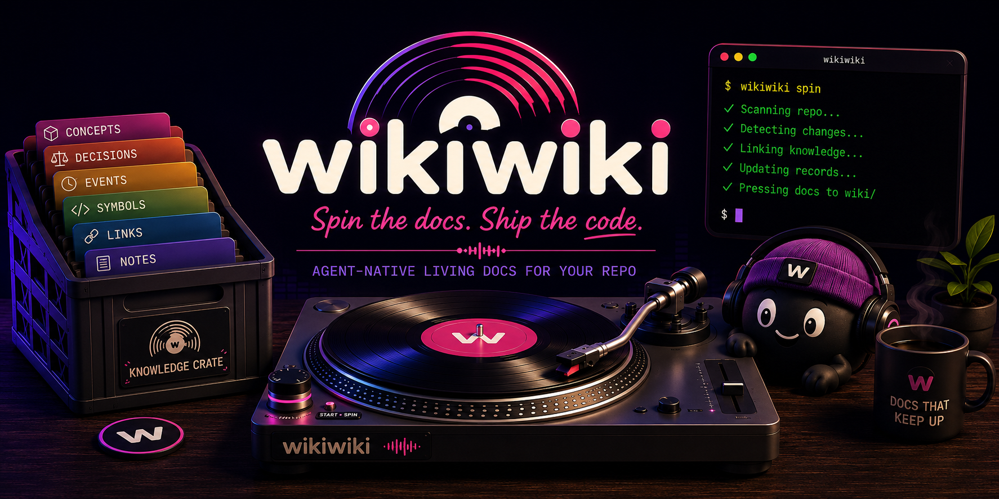

<p align="center">
  
</p>

# Wikiwiki

> Spin the docs. Ship the code.

Wikiwiki is an agent-native living documentation system for code repos. It keeps
important project knowledge in structured records, then renders both
agent-readable Markdown and a human-facing static wiki site.

The goal is simple: give coding agents a safe CLI for maintaining repo knowledge
as they work, without making the repo depend on a hosted service, database,
vector store, or hidden memory layer.

## Why Wikiwiki

Software teams lose context in the spaces between code:

- why a system exists
- what a module is responsible for
- which decisions shaped the current design
- what changed during a messy implementation session
- which generated docs should never be edited by hand

Wikiwiki turns that context into repo-local knowledge. Agents can update it with
boring terminal commands. Humans can browse it as a static wiki. Future tools
can query it as structured data.

Docs that keep up, in other words.

## The Loop

Wikiwiki is built around a small, repeatable workflow:

```sh
wk status --json
wk spin --json
wk note add "Renderer owns generated wiki files." --tags renderer,docs
wk validate
wk render
wk site
```

That loop lets an agent:

1. Inspect the current knowledge store.
2. Read working tree changes.
3. Add concepts, decisions, notes, events, symbols, and links.
4. Validate the records.
5. Render Markdown into `wiki/`.
6. Render a browseable static site into `wiki-site/`.

The structured records are the source of truth. Markdown stays simple and
deterministic for agents. The static site is the first-class human wiki.

## What It Stores

Wikiwiki stores records as append-friendly JSONL files under `.wikiwiki/records/`.

| Record | Use it for |
| --- | --- |
| `concept` | Domain terms, systems, patterns, and durable explanations |
| `decision` | Architecture, product, implementation, or workflow decisions |
| `event` | Development milestones and meaningful project changes |
| `note` | Lightweight facts, reminders, and working context |
| `symbol` | Important code symbols and their purpose |
| `link` | Relationships between records, files, and generated pages |

Each record carries `source`, `authority`, and `confidence` so agents can be
honest about what they know.

## What It Renders

Wikiwiki renders generated Markdown pages into `wiki/` for agents and plain-text
review:

```text
wiki/
  index.md
  concepts.md
  decisions.md
  devlog.md
  notes.md
  symbols.md
  links.md
```

Generated wiki files are plainly marked:

```html
<!-- Generated by Wikiwiki. Edit structured records instead. -->
```

That boundary matters. Agents should update structured records first, then run
`wk render`.

Wikiwiki also renders a static human-facing site into `wiki-site/`:

```text
wiki-site/
  index.html
  concepts.html
  decisions.html
  devlog.html
  notes.html
  symbols.html
  links.html
  search.html
  assets/
    wikiwiki.css
    search-index.js
    wikiwiki.js
```

The site uses normal `.html` links, a sidebar, responsive styling, subtle record
metadata, and local browser search. It does not rely on Jekyll routes or raw
front matter, so you can open `wiki-site/index.html` directly or serve the
folder as static files.

## What It Compiles

Wikiwiki can also compile role-oriented human wiki drafts from the same source
records:

```sh
wk compile draft --role all --json
wk compile apply compile_123 --json
```

`compile draft` creates an agent-mediated work packet under
`.wikiwiki/drafts/compile/`. Codex, Cursor, Claude Code, or another IDE agent
can use that packet to write polished UX and DX wiki prose. `compile apply`
then validates provenance and publishes the human-readable pages into
`wiki/human/`.

The UX wiki explains the product experience for users and stakeholders. The DX
wiki explains the developer experience for maintainers and coding agents.

## Install From Source

Wikiwiki is package-ready as `@thjodann/wk`; publishing is still a manual
release step. For now, install from source:

```sh
npm install
npm run build
```

Run it without linking:

```sh
npm run dev -- status --json
node dist/index.js status --json
```

Link it locally as `wk`:

```sh
npm link
wk status --json
```

The package installs `wk`; `wikiwiki` remains as a compatibility alias.

## Quick Start

Initialize Wikiwiki in a repo:

```sh
wk init
```

Check status:

```sh
wk status --json
```

Ask Wikiwiki to inspect the current working tree:

```sh
wk spin --json
```

Add a concept:

```sh
wk concept add \
  --name "Structured records" \
  --summary "JSONL records are the source of truth for repo knowledge." \
  --files .wikiwiki/records/concepts.jsonl \
  --tags architecture,docs
```

Add a decision:

```sh
wk decision add \
  --title "Use JSONL storage" \
  --context "Agents need storage they can inspect, append, validate, and repair." \
  --decision "Store each record type as append-only JSONL under .wikiwiki/records." \
  --consequences "The MVP stays repo-native and easy to audit."
```

Render the wiki:

```sh
wk validate
wk render
```

Generate the human-facing site:

```sh
wk site
open wiki-site/index.html
```

Search active records and rendered docs:

```sh
wk search renderer --json
```

## JSON-First Agent Workflows

Most add commands support JSON input and JSON output:

```sh
wk concept add --json '{
  "name": "Spin",
  "summary": "Inspects repo changes and suggests knowledge updates.",
  "files": ["src/cli/commands/spin.ts"],
  "tags": ["cli"],
  "source": "agent",
  "authority": "agent",
  "confidence": "high"
}'
```

Recommended authority rules:

- Use `authority: "user"` only for explicit user intent.
- Use `authority: "agent"` for agent-authored or inferred records.
- Use lower confidence when a record is a guess, partial summary, or stale.

## Record Revisions

Wikiwiki keeps record changes append-only. Updates add a new JSONL line with the
same logical `id`; deletes add a tombstone revision with `deleted_at`. Status,
rendering, search, and record reads use the latest active revision.

```sh
wk record list concept --json
wk record get concept concept_123 --json
wk record update concept concept_123 --json '{"summary":"Updated summary."}'
wk record delete concept concept_123 --reason "Superseded by decision_456"
```

## Commands

| Command | Purpose |
| --- | --- |
| `wk init` | Create the knowledge store and generated wiki folder |
| `wk status --json` | Report store status, record counts, generated pages, and Git changes |
| `wk spin --json` | Inspect current repo changes and suggest knowledge updates |
| `wk search <query> --json` | Search active records and rendered Markdown |
| `wk site` | Render a browseable static HTML wiki into `wiki-site/` |
| `wk compile draft --role all --json` | Create UX/DX human wiki drafts for an IDE agent |
| `wk compile apply <draft-id> --json` | Validate and publish a human wiki draft |
| `wk concept add` | Add a durable project concept |
| `wk decision add` | Add an architecture, product, or workflow decision |
| `wk event add` | Add a development event |
| `wk note add` | Add a lightweight note |
| `wk symbol add` | Add an important code symbol |
| `wk link add` | Link records, files, or wiki pages |
| `wk record list/get/update/delete` | Read and revise active records append-only |
| `wk validate` | Validate records and references |
| `wk render` | Render Markdown pages into `wiki/` |

## GitHub Pages

`wk site` writes static files and a `.nojekyll` marker into `wiki-site/`, so
GitHub Pages can publish the folder without Jekyll-specific routing. Once the
package is published, a minimal workflow can build and upload that folder:

```yaml
name: Publish Wikiwiki Site

on:
  push:
    branches: [main]

permissions:
  contents: read
  pages: write
  id-token: write

jobs:
  publish:
    runs-on: ubuntu-latest
    steps:
      - uses: actions/checkout@v4
      - uses: actions/setup-node@v4
        with:
          node-version: 22
      - run: npm ci
      - run: npm run build --if-present
      - run: npx @thjodann/wk render
      - run: npx @thjodann/wk site
      - uses: actions/upload-pages-artifact@v3
        with:
          path: wiki-site
      - uses: actions/deploy-pages@v4
```

## Where It Is Headed

The turntable metaphor is light, but useful:

- `spin` inspects repo changes and suggests knowledge updates.
- `scratch` could review recent knowledge, events, and contradictions.
- `press` could become a friendly alias for rendering docs.
- `crate` could rebuild indexes and local retrieval data.
- `ask` could query the repo knowledge base.
- `watch` could batch near-real-time updates while work is happening.

Wikiwiki should stay local-first, text-first, and agent-friendly even as those
capabilities grow.

## Current Status

Wikiwiki is a V1 CLI foundation. It currently includes:

- TypeScript CLI
- JSONL record storage
- append-only record revisions and deletion tombstones
- Zod validation
- Git-aware `spin` with draft templates
- Markdown rendering for concepts, decisions, events, notes, symbols, and links
- static HTML site generation into `wiki-site/`
- agent-mediated UX/DX human wiki compilation
- local search across active records and rendered docs
- Agent-readable JSON output
- CI, tests, and package metadata for `@thjodann/wk`

Some planned pieces are not built yet:

- richer symbol extraction
- draft review flows
- watch mode
- actual npm publishing

The north star is still clear: living docs that are easy for agents to maintain
and easy for humans to trust.

## Development

Build:

```sh
npm run build
```

Run checks:

```sh
npm run check
```

Run tests:

```sh
npm test
```

Verify package contents:

```sh
npm run pack:dry-run
```

Run the CLI in development:

```sh
npm run dev -- spin --json
```

## License

MIT
